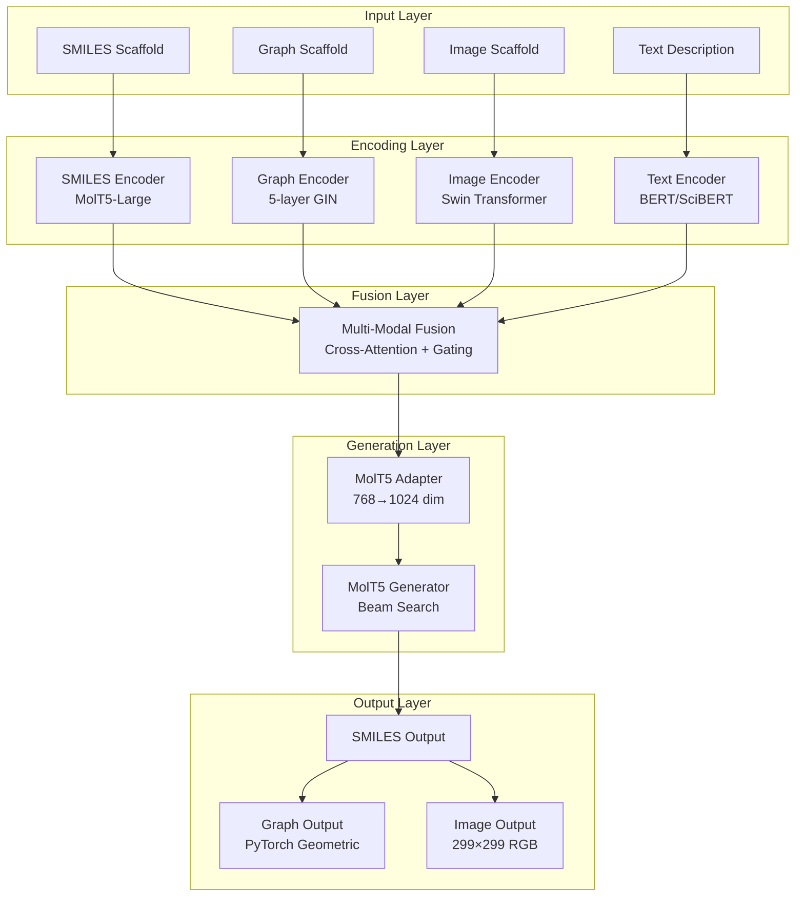
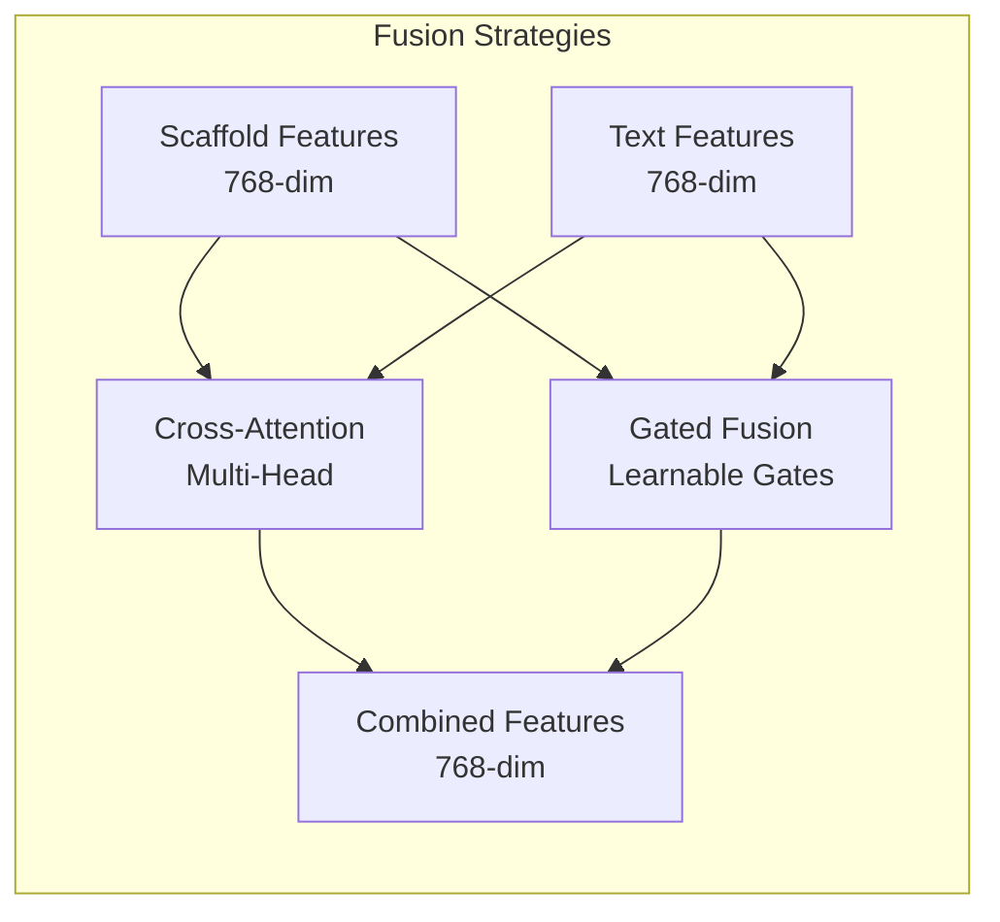

# Text2Mol 系统架构文档

## 🏗️ 总体架构

Text2Mol是一个基于Scaffold的多模态分子生成系统，支持7种输入-输出组合，集成了先进的深度学习架构。



## 📋 核心组件详解

### 1. 多模态编码器系统

#### SMILES编码器
```python
class SMILESEncoder:
    - Backbone: MolT5-Large (3GB)
    - Input: SMILES字符串
    - Output: 768-dim特征向量
    - 特点: 预训练分子表示，冻结权重
```

#### 图编码器  
```python
class GraphEncoder:
    - Architecture: 5-layer GIN网络
    - Input: 分子图 (PyTorch Geometric)
    - Output: 768-dim特征向量
    - 特点: 原子/化学键特征，图级池化
```

#### 图像编码器
```python
class ImageEncoder:
    - Architecture: Swin Transformer
    - Input: 299×299 RGB图像
    - Output: 768-dim特征向量
    - 特点: 分层注意力，预训练权重
```

#### 文本编码器
```python
class TextEncoder:
    - Architecture: BERT/SciBERT
    - Input: 分子描述文本
    - Output: 768-dim特征向量
    - 特点: 科学领域预训练，特殊token扩展
```

### 2. 模态融合层



**融合策略**:
- **Cross-Attention**: 多头注意力机制，学习跨模态关联
- **Gated Fusion**: 可学习门控机制，动态权重分配  
- **Combined**: 两种策略结合，最优特征融合

### 3. MolT5生成系统

#### 适配层
```python
class MolT5Adapter:
    - Function: 768-dim → 1024-dim 维度适配
    - Architecture: Linear + LayerNorm + GELU
    - Sequence: 扩展为transformer输入序列
    - Position: 添加位置编码
```

#### 生成器
```python  
class MolT5Generator:
    - Backbone: MolT5-Large预训练模型
    - Generation: Beam Search (num_beams=3-5)
    - Temperature: 0.8 (可调随机性)
    - Max Length: 128 tokens
```

### 4. 输出解码系统

```mermaid
graph TD
    A[Generated SMILES] --> B{Target Output}
    B -->|SMILES| C[Direct Output]
    B -->|Graph| D[SMILES→Graph Decoder<br/>RDKit + PyTorch Geometric]
    B -->|Image| E[SMILES→Image Decoder<br/>RDKit + PIL]
    
    D --> F[PyTorch Data Object<br/>Nodes + Edges + Features]
    E --> G[299×299 RGB Array<br/>Normalized [0,1]]
```

## 🔧 技术规格

### 模型参数
- **总参数量**: 596.52M
- **可训练参数**: 59.08M (10%)
- **冻结参数**: 537.44M (90%)

### 性能指标
- **GPU显存需求**: ~8GB (batch_size=2)
- **推理速度**: ~0.5s/sample
- **支持的模态组合**: 7种 (3输入×3输出 - 2重复)

### 数据规格
- **训练数据**: ChEBI-20数据集 (33,010条记录)
- **特征维度**: 统一768-dim表示
- **图像尺寸**: 299×299×3
- **最大序列长度**: 128 tokens

## 📊 支持的输入-输出组合

| 输入模态 | 输出模态 | 状态 | 说明 |
|----------|----------|------|------|
| SMILES + Text | SMILES | ✅ | 基础SMILES生成 |
| SMILES + Text | Graph | ✅ | SMILES→图转换 |
| SMILES + Text | Image | ✅ | SMILES→图像转换 |
| Graph + Text | SMILES | ✅ | 图→SMILES生成 |
| Graph + Text | Graph | ✅ | 图→图生成 |
| Graph + Text | Image | ✅ | 图→图像生成 |
| Image + Text | SMILES | ✅ | 图像→SMILES生成 |
| Image + Text | Graph | ✅ | 图像→图生成 |
| Image + Text | Image | ✅ | 图像→图像生成 |

## 🚀 关键创新点

### 1. 统一特征表示
所有模态编码器输出统一的768维特征，确保跨模态兼容性。

### 2. 自适应融合机制  
结合注意力和门控机制，动态学习最优的模态融合权重。

### 3. 端到端训练
整个pipeline可端到端训练，模态间特征对齐自动优化。

### 4. 灵活的输出格式
支持SMILES、分子图、分子图像三种输出格式，满足不同应用需求。

### 5. 预训练模型集成
充分利用MolT5、BERT、Swin Transformer等预训练模型的强大表示能力。

## 📈 扩展性设计

### 模块化架构
各组件独立可替换，支持：
- 编码器替换（如使用ChemBERT替代BERT）
- 融合策略扩展（添加新的融合方法）
- 输出格式增加（支持3D结构、性质预测等）

### 配置化系统
通过YAML配置文件灵活调整：
- 模型超参数
- 训练策略
- 硬件配置
- 数据路径

---

*该架构文档与代码实现保持同步，最后更新: 2025-08-06*