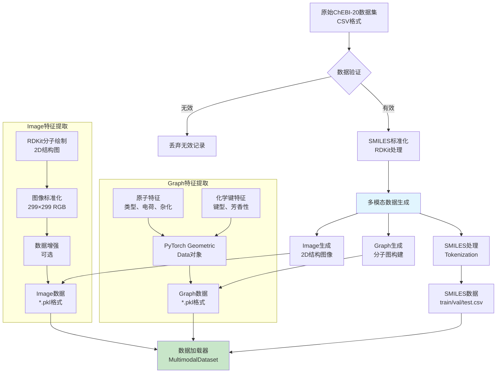
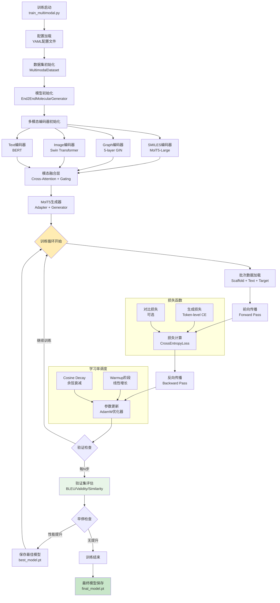
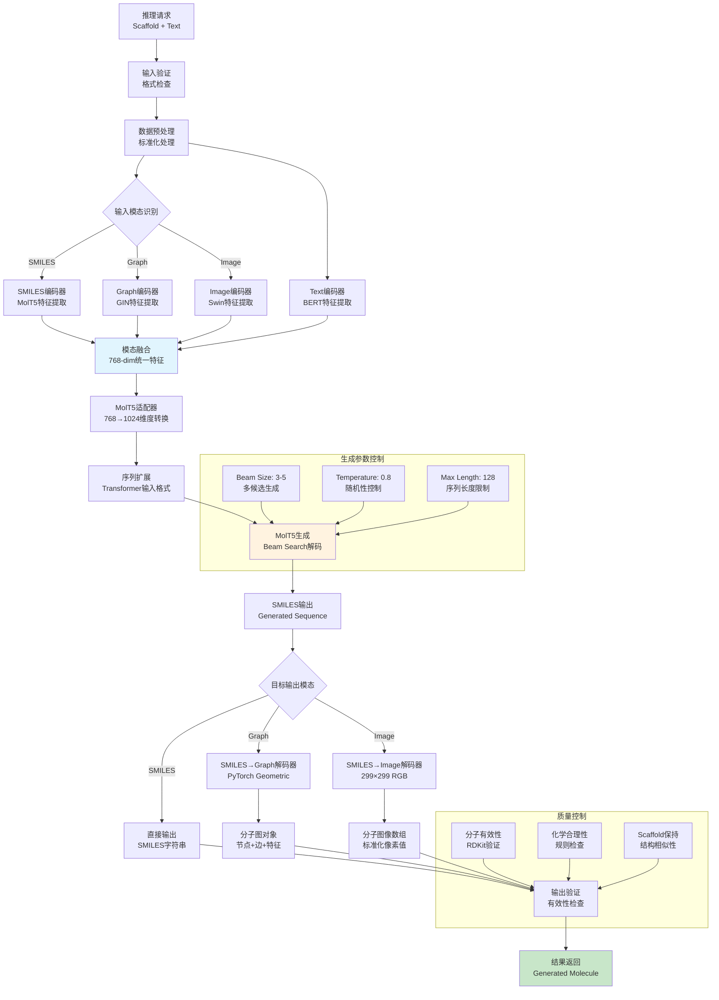
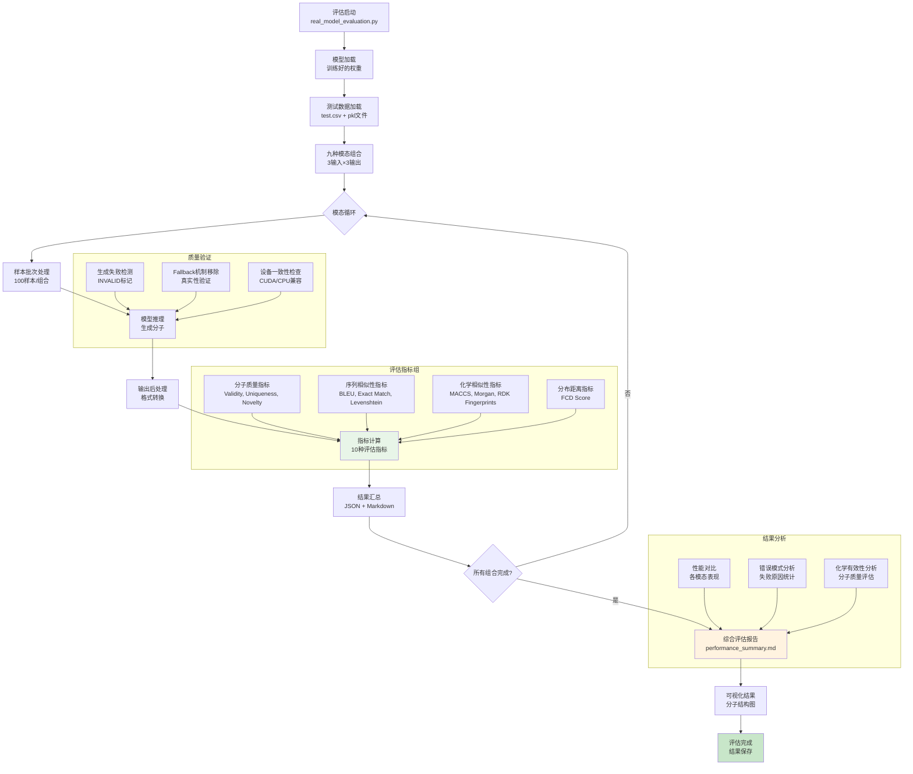
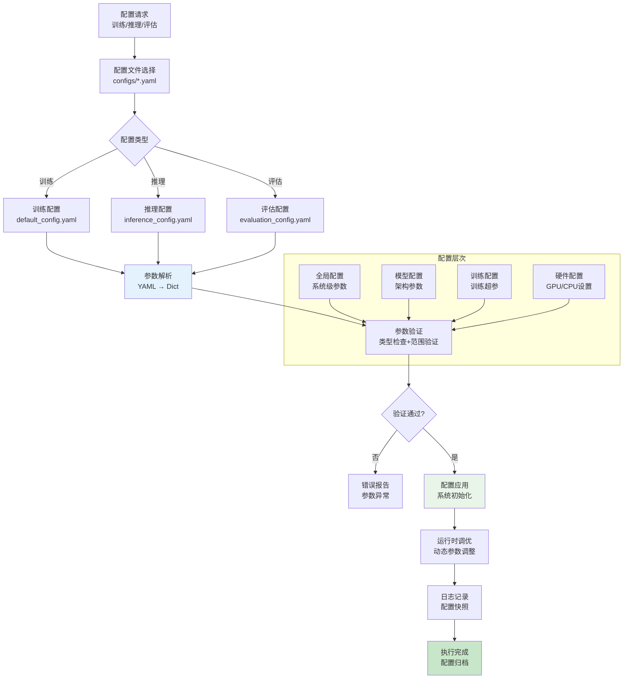
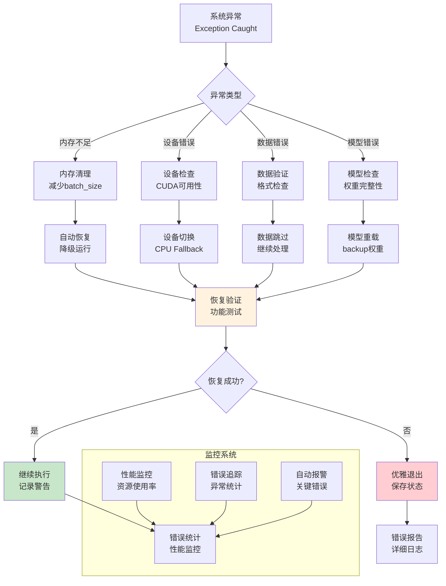

# Text2Mol 工作流程图文档

## 🔄 系统工作流程总览

本文档详细描述了Text2Mol系统的各个工作流程，包括数据预处理、模型训练、推理生成和评估验证。

## 📊 1. 数据预处理流程

## 🎯 2. 模型训练流程

## 🔮 3. 模型推理流程

## 📈 4. 模型评估流程

## ⚙️ 5. 配置管理流程

## 🔧 6. 错误处理和恢复流程

## 📊 流程性能指标

### 时间复杂度
- **数据预处理**: O(n) - 线性于数据量
- **模型推理**: O(1) - 固定时间（单样本）
- **批量生成**: O(batch_size) - 线性于批次大小

### 空间复杂度
- **模型内存**: ~8GB（batch_size=2）
- **数据缓存**: ~2GB（完整数据集）
- **临时存储**: ~500MB（处理过程）

### 并发能力
- **多GPU训练**: 支持数据并行
- **多进程推理**: CPU/GPU异构计算
- **批量处理**: 最大batch_size=16

---

*该流程文档基于实际代码实现，最后更新: 2025-08-06*